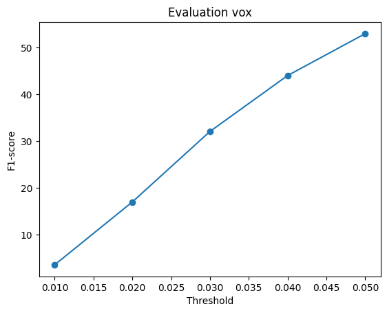
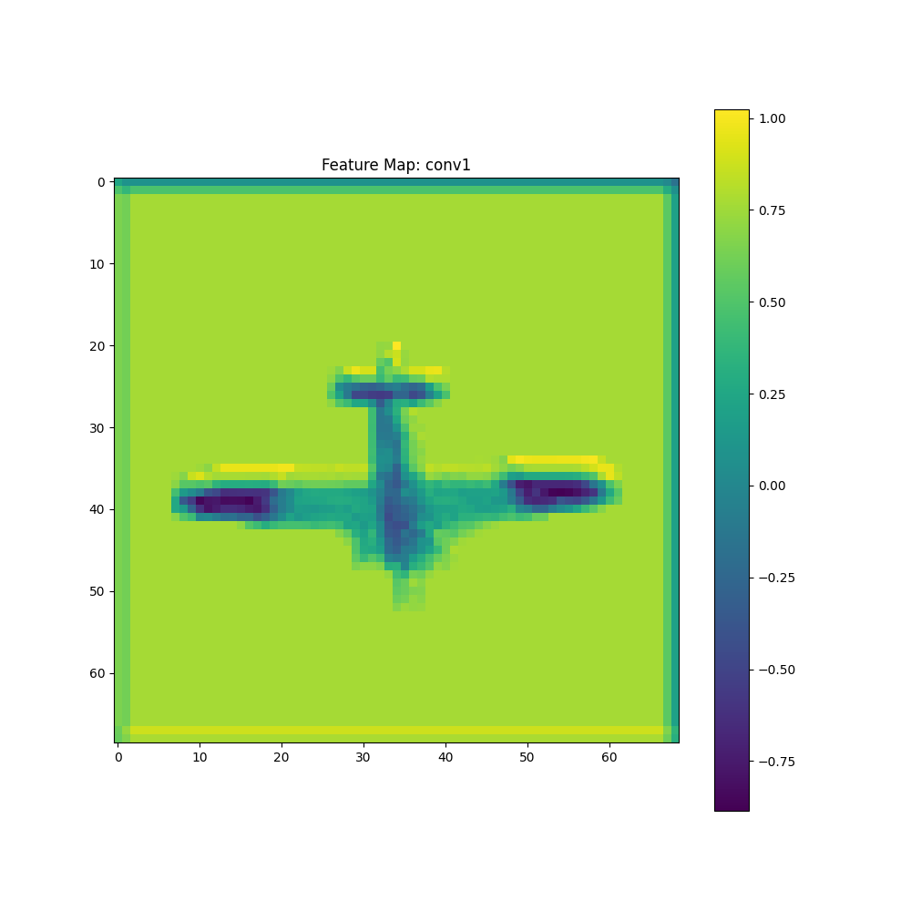
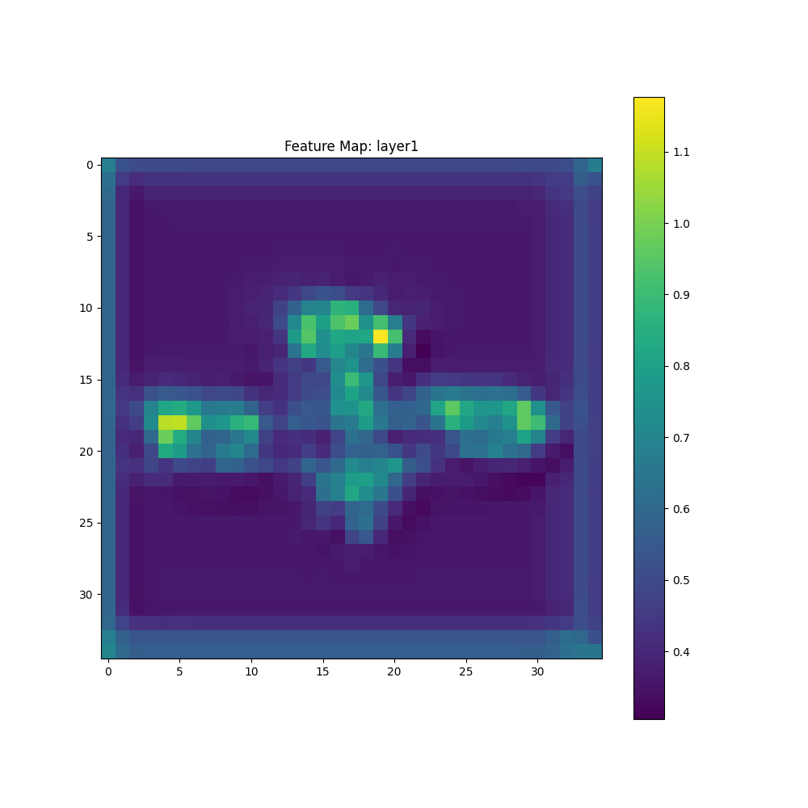
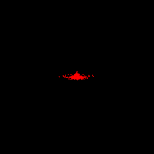

# 16825: Learning For 3D Vision
## Project 2 Results - vinayakp

### Q1. Loss Functions
### 1.1 Fitting Voxel Grid

    <figure style="display:inline-block; text-align:center; margin:10px;">
        
        <figcaption>Ground Truth Voxel Grid</figcaption>
    </figure>
    <figure style="display:inline-block; text-align:center; margin:10px;">
        
        <figcaption>Optimized Voxel Grid</figcaption>
    </figure>

### 1.2 Fitting Point Cloud

    <figure style="display:inline-block; text-align:center; margin:10px;">
        
        <figcaption>Ground Truth Point Cloud</figcaption>
    </figure>
    <figure style="display:inline-block; text-align:center; margin:10px;">
        
        <figcaption>Optimized Point Cloud</figcaption>
    </figure>

  
### 1.3 Fitting Mesh

    <figure style="display:inline-block; text-align:center; margin:10px;">
        
        <figcaption>Ground Truth Mesh</figcaption>
    </figure>
    <figure style="display:inline-block; text-align:center; margin:10px;">
        
        <figcaption>Optimized Mesh</figcaption>
    </figure>

### Q2. Reconstructing 3D from single view
### 2.1 Image to voxel grid
<table>
 <tr>
  <th>RGB Input Image</th>
  <th>Predicted 3D Voxel Grid</th>
  <th>Ground Truth Mesh</th>
 </tr>
 <tr>
  <td></td>
  <td></td>
  <td></td>
 </tr>
 <tr>
  <td></td>
  <td></td>
  <td></td>
 </tr>
 <tr>
  <td></td>
  <td></td>
  <td></td>
 </tr>
</table>

### 2.2 Image to point cloud
<table>
 <tr>
  <th>RGB Input Image</th>
  <th>Predicted 3D Point Cloud</th>
  <th>Ground Truth Mesh</th>
 </tr>
 <tr>
  <td></td>
  <td></td>
  <td></td>
 </tr>
 <tr>
  <td></td>
  <td></td>
  <td></td>
 </tr>
 <tr>
  <td></td>
  <td></td>
  <td></td>
 </tr>
</table>

### 2.3 Image to mesh
<table>
 <tr>
  <th>RGB Input Image</th>
  <th>Predicted Mesh</th>
  <th>Ground Truth Mesh</th>
 </tr>
 <tr>
  <td></td>
  <td></td>
  <td></td>
 </tr>
 <tr>
  <td></td>
  <td></td>
  <td></td>
 </tr>
 <tr>
  <td></td>
  <td></td>
  <td></td>
 </tr>
</table>

## 2.4 Quantitative comparisions
<table>
 <tr>
  <th>Voxel Grid</th>
  <th>Point Cloud</th>
  <th>Mesh</th>
 </tr>
 <tr>
  <td></td>
  <td></td>
  <td></td>
 </tr>
</table>
From a perspective of quantity, Voxel Grids had the lowest avg. F1-score (among the 3 forms of representation) of around 52% at a threshold of 0.05. It is likely because the model was not able to converge during training. Meshes had higher F1-score than Voxel Grid, slightly higher than 70%. This may be because Meshes inherently have connectivity information but the Mesh predictions in Q2.3 seem to have problems in fitting the triangles. Point clouds on the other end had the highest F1-score of around 80% on average even though the number of points were 1000. The predicted point clouds in 2.2 are capturing surface details of the input image objects quite accurately implying convergence during training. Point clouds do not have any connectivity and so it is easier for them to align with the object surfaces easily unike meshes and voxel grids that need to handle connectivity or require dense occupancy. Thus, or meshes and voxel grids to have higher F1-scores, we need to train them for more iteerations as compared to point clouds. (All the 3 models were trained for 10000 iterations with other hyperparameters set to the default value) 

## 2.5 Analyse effects of hyperparams variations
<table>
 <tr>
  <th>1000 Points</th>
  <th>5000 Points</th>
  <th>9000 Points</th>
 </tr>
 <tr>
  <td></td>
  <td></td>
  <td></td>
 </tr>
 <tr>
  <td></td>
  <td></td>
  <td></td>
 </tr>
</table>
For this question, I set the n_points parameter for Point Cloud at 1000, 5000 and 9000 points for comparison study. (I could not increase the value above 9000 as it throwed me CUDA Out of Memory error while training). The models were trained for 1000 iterations (max_iter), with a batch_size of 8 and a learning rate (lr) of 0..001 in order to reduce training time. 

Analysis: The F1 score increased (left to right) from 70% for 1000 points to ~80% for 5000 points to ~85% for 9000 points. We can see that upon increasing 4000 points from 1000 to 5000 we got a 10% increase in F1-score but only got 5% improvement upon increasing points from 5000 to 9000. Thus the F1-score improvement is becoming stagnant upon increasing points. This trend is not surprising at all because we can see in the GIFs above that upon increasing the points in the pointcloud, most of the 'extra' points occupied larger sections of the chair like the seating and the back-rest but the number of points near the legs and arm rests remained almost the same. So, I think it would be better if we could implement some strategies to sample the points and distribute them uniformely to better capture all the relevant details and saving us computation time, ensuring both, higher accuracy as well as computational efficiency.  

## 2.6 Interpret your model
Below are the Feature maps obtained by adding hooks to different layers of ResNet18 encoder. They  capture the intermediate activations during the forward pass of the network. The hooks are registered using PyTorch's register_forward_hook() function, allowing us to extract and visualize how the network processes information at every layer. 

    <figure style="display:inline-block; text-align:center; margin:10px;">
        
        <figcaption>Feature map post Conv1</figcaption>
    </figure>
    <figure style="display:inline-block; text-align:center; margin:10px;">
        
        <figcaption>Feature map post Layer1</figcaption>
    </figure>

    <figure style="display:inline-block; text-align:center; margin:10px;">
        
        <figcaption>Feature map post Layer2</figcaption>
    </figure>
    <figure style="display:inline-block; text-align:center; margin:10px;">
        
        <figcaption>Feature map post Layer3</figcaption>
    </figure>

    <figure style="display:inline-block; text-align:center; margin:10px;">
        
        <figcaption>Feature map post Layer4</figcaption>
    </figure>
Interpretation:  
The model's feature processing displays a clear progression through its layers, demonstrating how it transforms a 2D image into meaningful features for 3D reconstruction.  
> Starting with Conv1 (layer 0), the model captures basic edges and structural boundaries of the input shape.  
> Layer 1 begins to abstract these features while maintaining key structural elements at a lower resolution.  
> Layer 2 further compresses the information and shows stronger activations at critical structural points while filtering out background noise.  
> Layer 3 creates a more abstract representation that preserves global structural relationships.  
> Lastly, Layer 4 shows the most condensed encoding, with highly selective activation patterns concentrated in the top-left quadrant (shown by bright yellow and green regions) against minimal activation elsewhere (dark purple), indicating the model has learned to focus only on the most essential features needed for 3D reconstruction.  
Such abstraction from edges to compact and high-level structural features depicts how the model is extracting the most important 3D information from the provided 2D input image.

### Q3. Exploring other architectures / datasets
### 3.3 Extended dataset for training
<table>
 <tr>
  <th>RGB Input Image</th>
  <th>Predicted 3D Point Cloud</th>
  <th>Ground Truth Mesh</th>
 </tr>
 <tr>
  <td></td>
  <td></td>
  <td></td>
 </tr>
 <tr>
  <td></td>
  <td></td>
  <td></td>
 </tr>
 <tr>
  <td></td>
  <td></td>
  <td></td>
 </tr>
</table>

    <figure style="display:inline-block; text-align:center; margin:10px;">
        
        <figcaption>Ground Truth Mesh</figcaption>
    </figure>

I ran this model with a lr of 0.0008 for 1400 iterations and a batch_size of 8 due to scarcity of time. I even had to reduce the frame rate of the ground truth mesh as I was encountering CUDA Out of Memory error with the full dataset.

Thoughts and Analysis: I feel that for the point cloud, it has accurately predicted the objects and their surfaces and the point clouds contain less noise while training on the full R2N2 dataset. This may be because for the full dataset, it has a wider variety of objects to train on which gives very accurate results. Even though the iterations for training on full dataset were 1000, it gave an average F1-score of ~83% which is very close to the average F1-score I achieved upon training the model for 10000 iterations with default hyper-parameters on the R2N2 dataset containing only the chair class. While training with the full dataset with 3 classes and aforementioned hyper-parameters took around 1.5 hours, training for 10000 iterations on only the chair class took around 6 hours with the default hyper-parameters. So, I think that it would be better to train the model on a diverse set of objects rather than of only 1 type for getting more accuracy and less noise. 
